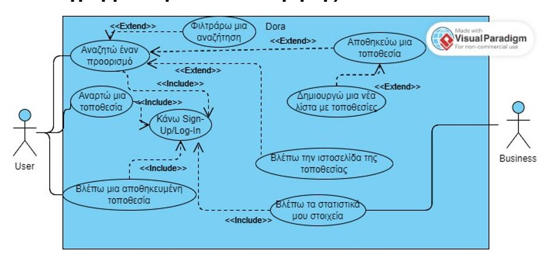
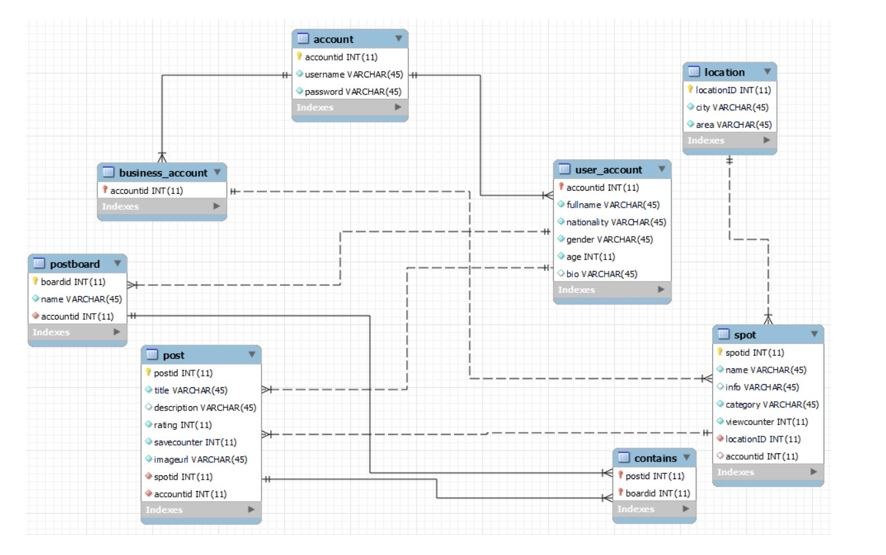
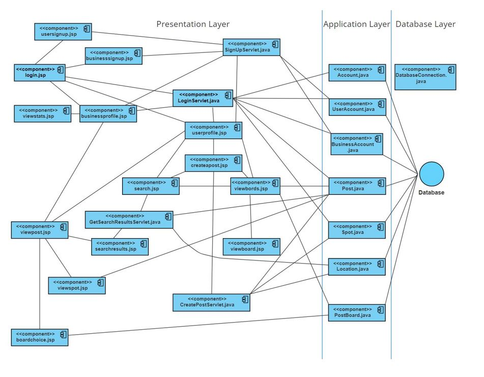

# Dora: A Social Networking Web Application for Tourism

## 📌 Project Overview
**Dora** is a **web and mobile-friendly social networking application** inspired by Pinterest that allows users to **post, search, and save travel destinations**. The application aims to create **engagement between travelers and businesses**, helping users discover noteworthy spots and organize their travel experiences efficiently.

### 🏆 Features
- **User and Business Accounts**: Users can create personal or business profiles.
- **Post and Save Travel Spots**: Share and bookmark destinations.
- **Search & Filter**: Find locations based on category (restaurants, cafes, museums, parks, landmarks, bars).
- **Business Analytics**: Track visits, saves, and user engagement metrics.
- **Profile & Spot Interactions**: Businesses and users can interact through shared content.
- **Board Organization**: Save and categorize travel plans.

## 🛠️ Technologies Used
- **Frontend:** HTML, CSS, JavaScript
- **Backend:** Java (Servlets, JSP)
- **Database:** MySQL
- **Hosting:** Apache Tomcat

## 📊 Use Case Scenarios
- **Login/Signup**: Users and businesses authenticate using credentials.
- **Search Destinations**: Find spots based on categories and tags.
- **Create Posts**: Upload photos, descriptions, and reviews for locations.
- **Save Locations**: Bookmark favorite destinations for future trips.
- **Business Analytics**: View profile visits, user demographics, and engagement.

## 📖 Data Model
- **Users Table:** Stores user credentials and profile details.
- **Posts Table:** Contains information about travel spots shared.
- **Business Accounts Table:** Maintains company profiles and analytics.
- **User Boards Table:** Saves user-specific travel plans and bookmarked locations.

## 🌍 Deployment
- **Hosting:** Deployed on **Apache Tomcat** for backend.
- **Database:** MySQL database
- **Frontend:** Optimized for web & mobile accessibility.

### 🎨 Design and Architecture

### 🔖 The team
Our project team:
- **Elina Kapetanaki**
- **Evangelos Siamantouras**
- **Aggeliki Tsagkaraki**
- **Nikol Chloveraki**

